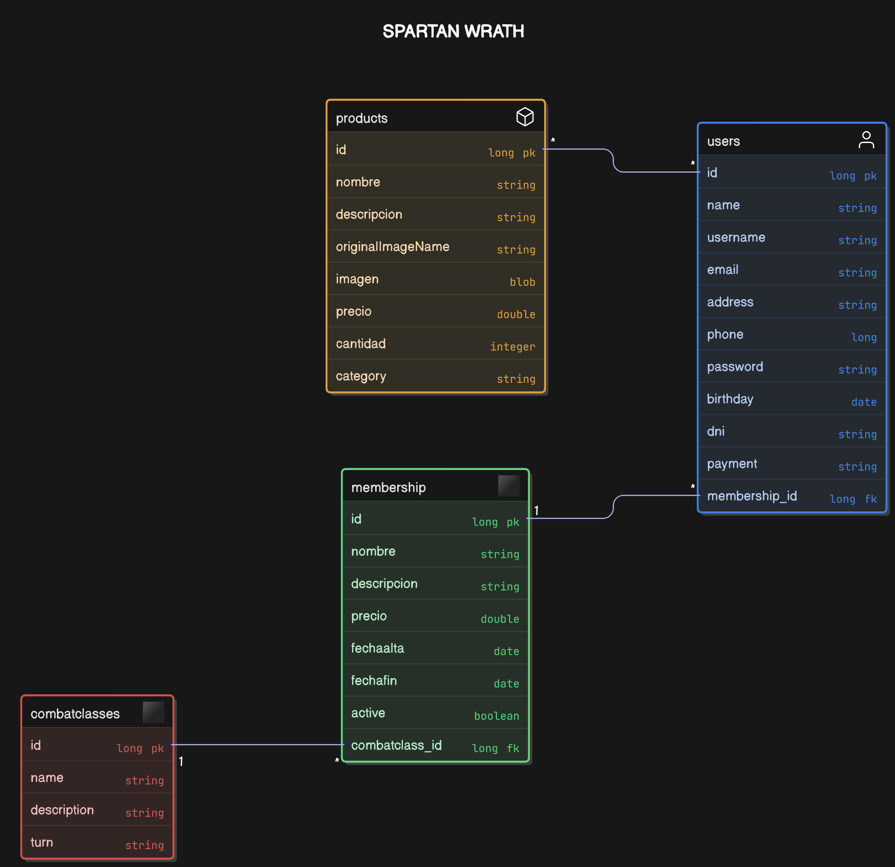

# Spartan Wrath

<h1 >Hola 👋, Somos Spartan's Wrath</h1>
<h3 >Grupo R-2 de Desarrollo Web Seguro</h3> 

## 📌 Descripción de la Aplicación Web

**Spartan Wrath** es la página web de un gimnasio dedicado a diferentes artes marciales, tiene una tienda y da la opción de suscribirse a diferentes membresías, crear una cuenta...

## 👥 Integrantes del equipo de desarrollo

| Nombre                  | Usuario GitHub  | Correo universitario               |
|-------------------------|----------------|-----------------------------------|
| Daniel Vallejo Pasamón  | dvallejo99     | [d.vallejo.2021@alumnos.urjc.es](mailto:d.vallejo.2021@alumnos.urjc.es) |
| Cesar Martín Baños      | Cesarmb3       | [c.martinb.2021@alumnos.urjc.es](mailto:c.martinb.2021@alumnos.urjc.es) |

## 📄 Entidades

La aplicación gestiona las siguientes entidades principales:
- **Usuario**: Para diferenciar entre los diferentes clientes y gestionar los roles.
- **Membresía**: Diferentes suscripciones que puede tener el cliente.
- **Clase de combate**: Clases que imparte el gimnasio.
- **Producto**: Diferentes objetos que pueden comprar los clientes.

### Relación entre Entidades
- Un Usuario puede tener varios productos, puede estar suscrito a una membresía.
- Una Membresía solo puede tener asociada una clase de combate.
- Una Clase de combate puede pertenecer a varias membresías.

## 🔑 Permisos de los Usuarios

| Tipo de Usuario | Permisos                                                         |
|-----------------|------------------------------------------------------------------|
| Administrador   | Gestión completa de Usuarios, Suscripciones, Clases y Productos. |
| Usuario         | Compra de productos y suscripcion a membresías                   |

## 🖼️ Imágenes Asociadas

- Los Productos tienen una imagen.

## 📊 Diagrama de Entidades

## 💪 Desarrollo Colaborativo

### Daniel Vallejo Pasamón
Como partimos de la practica del año pasado nos hemos dedicado a comprobar vulnerabilidad por vulnerabilidad si estaba mitigada o faltaba algo.

**Commits más significativos:**
- [Commit 1](https://github.com/DWS-2025/project-grupo-r-2/commit/16bd8f5ef89168522d7c6f1111c5616ec4035b8f) Catchear excepcion que antes haciamos de manera vulnerable y no especifica.
- [Commit 2](https://github.com/DWS-2025/project-grupo-r-2/commit/fb9bf03c8821392361af5fa9420c4d39def85959) Sanitizar ruta de fichero externo que no se hacia.
- [Commit 3](https://github.com/DWS-2025/project-grupo-r-2/commit/2641400946afde1b9dbcac56f3de98ab85b341dd) Igual que el anterior commit, sanitizar rutas.
- [Commit 4](https://github.com/DWS-2025/project-grupo-r-2/commit/8ac9c1f2ebf027992333cfda6bee308315cc44ba) Especificar el default enconding.
- [Commit 5](https://github.com/DWS-2025/project-grupo-r-2/commit/d227adaeddcf7572c295cbbf0df0e7ca0bb2b630) Solo admin puede listar todos los usuarios.
**Ficheros principales modificados:**
- `UserRestController.java`
- `ImageService.java`
- `MarketControlelr.java`
- `DataBaseInitializer.java`
- `JwtTokenProvider.java`

### Cesar Martín Baños
En esta fase, al tenerlo casi todo del año pasado y al ir actualizando esta fase conforme avanzabamos en las anteriores, hemos revisado posibles vulnerabilidades, pero hemos hecho pocos cambios.

**Commits más significativos:**
- [Commit 1](https://github.com/DWS-2025/project-grupo-r-2/commit/49a3170211ded55107200c9d642112161a67411f) Descargar imagen de disco
- [Commit 2](https://github.com/DWS-2025/project-grupo-r-2/commit/4bcf9b034a6047faf52fd0bd92be3aebace6b774) Actualizo nueva carpeta Security
- [Commit 3](https://github.com/DWS-2025/project-grupo-r-2/commit/d609c5c1a3f53d801b329d4e1e5e41c5514a9d95) Quito librerias no utilizadas y configuro el control de acceso
- [Commit 4](https://github.com/DWS-2025/project-grupo-r-2/commit/bdde66ec8b9950b43be93edc1047809112a10a84) Añado los iconos para obtenerlos del disco y no hacer conexiones a otras páginas web
- [Commit 5](https://github.com/DWS-2025/project-grupo-r-2/commit/1d0d66cd645041f7eef817a818b8729765edd26b) Sanitizo la clase User

**Ficheros principales modificados:**
- `SecurityConfig.java`
- `MarketController.java`
- `DatabaseInitializer.java`
- `/bootstrap-icons-1.11.3`
- `application.properties`
---
